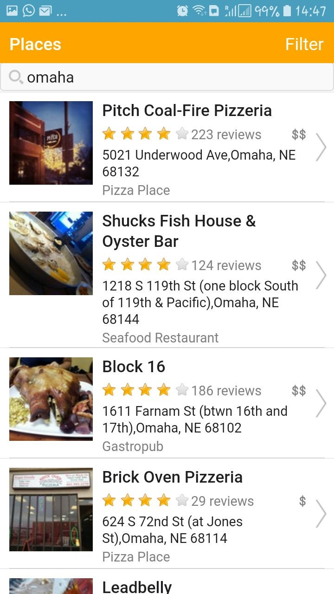
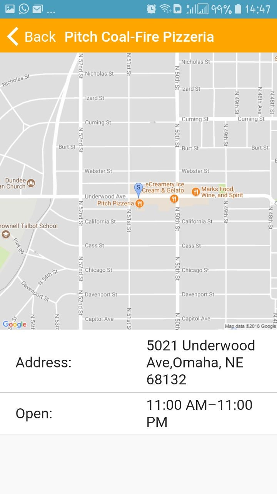
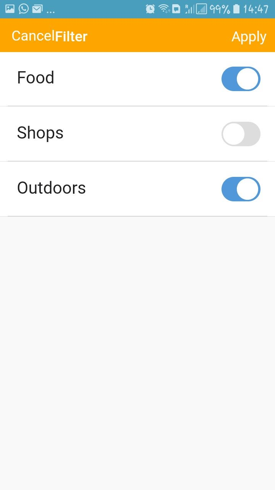

# MobileApplication

As part of my learning in my course Enterprise Architecture and Systems Development, I am building a mobile application using Monaco for the Software build.
I have used Nox Emulator for the layout and usability of the application.

My application is simple and shows all the restaurants, shops and outdoor facilities using static google map and four square API.

The screenshots of my application are -

> This shows the home page showing all the available outdoors for the keyword 'Omaha'

> On click of Pitch Coal Fire-Pizzeria, I get the map showing the location of this store.

>Filter that is currently available for this application.

The link for the Android Application is given - [Android App](https://jantz021991.github.io/Rest4Best/)

- DJ (17th March 2018)
